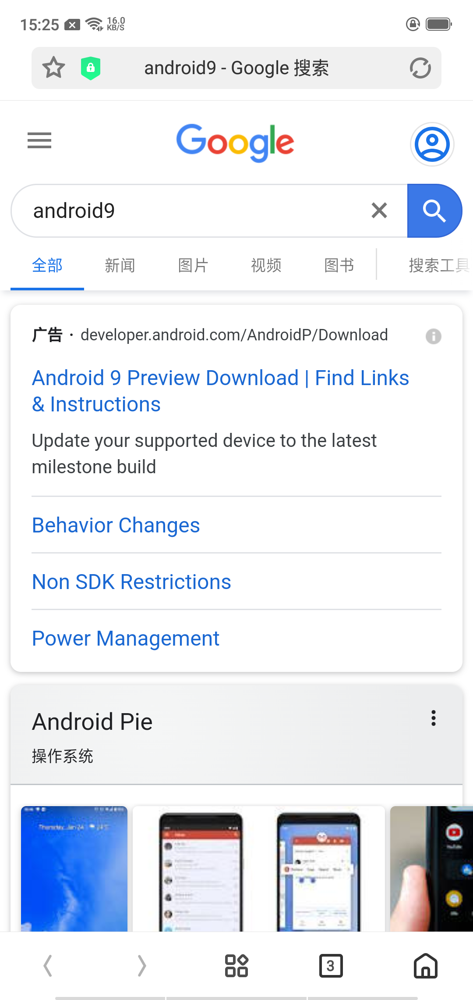
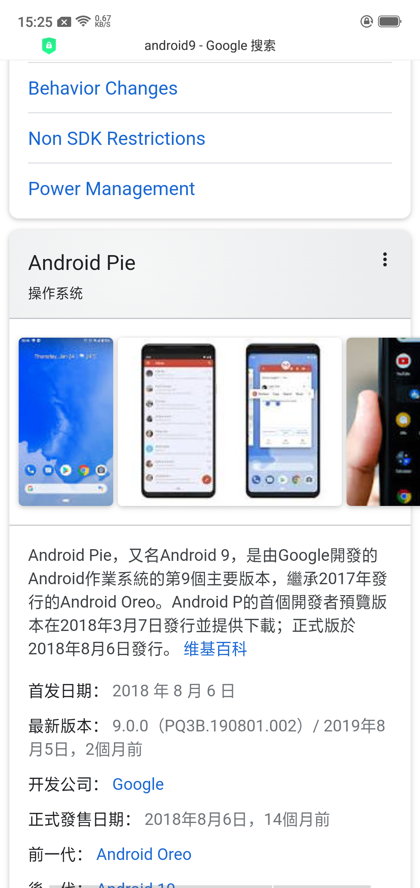
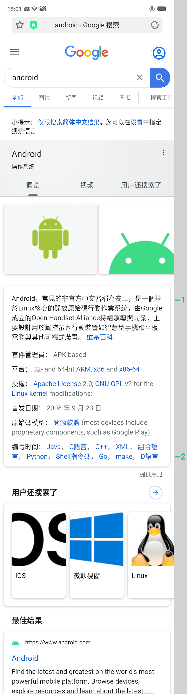
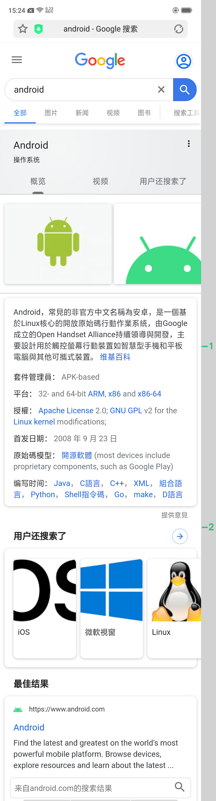
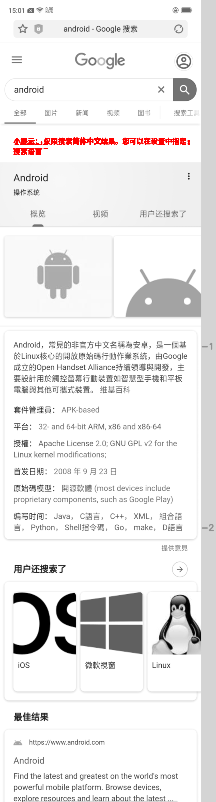

# Vision UI

## 什么是Vision UI

Vision是一组图像处理算法，为移动端UI测试提供基于图像的处理能力，如视觉对比(增量式对比)、图像融合和文本识别。本项目无需训练模型，可以直接部署运行。
基于训练模型的项目在[Vision-ml](https://github.com/Meituan-Dianping/vision)

## 特性

* 超越像素对比-[视觉对比](resources/vision_diff_cn.md)

* 基于模板匹配-[图像融合](resources/vision_merge.md)

* 集成模型-[文本识别](resources/vision_text.md)

## 效果展示
### 图像融合
| 1.png                           | 2.png                           |  3.png                   | merge                                  |
| ------------------------------ | -------------------------------- | -------------------------------- | ------------------------------------- |
|           |                   |         |                  

### 视觉对比

| base                           | comparison                       | diff                                  |
| ------------------------------ | -------------------------------- | ------------------------------------- |
|           |             |                  |

## License

This project is licensed under the [MIT](./LICENSE) 

