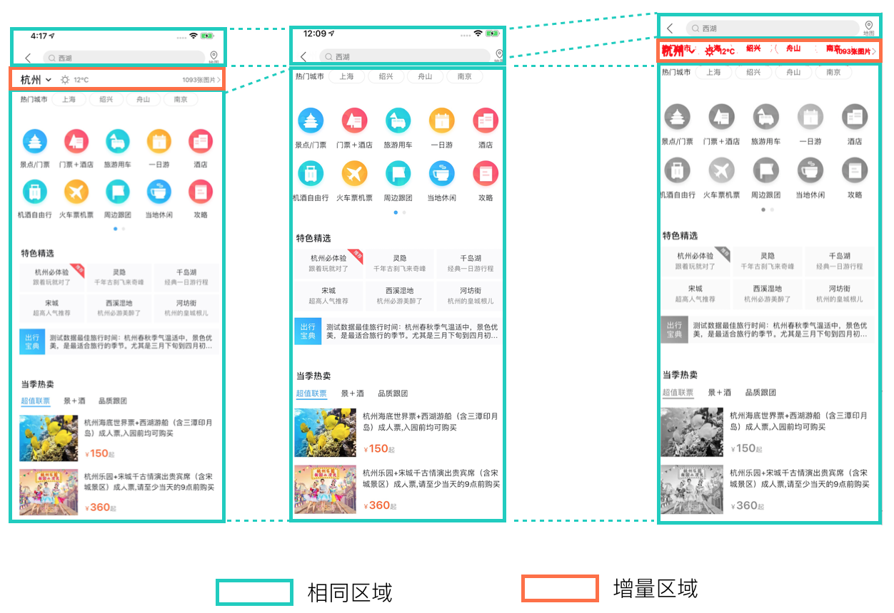
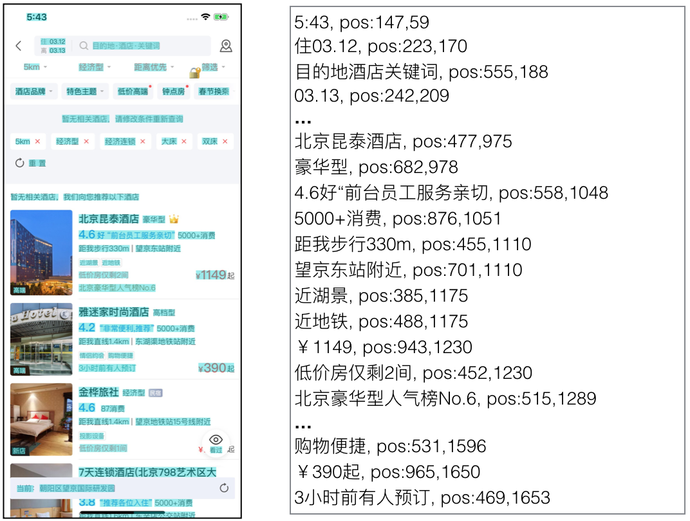

# Vision UI

> 移动端UI处理算法

## 目录

* [图像对比算法](resources/vision_diff_en.md)

* [图像文本识别](resources/vision_text.md)

* [活动弹窗识别](https://github.com/Meituan-Dianping/vision)

## 快速开始

* [启动服务](resources/container_service.md)

## License

This project is licensed under the [MIT](./LICENSE) 

