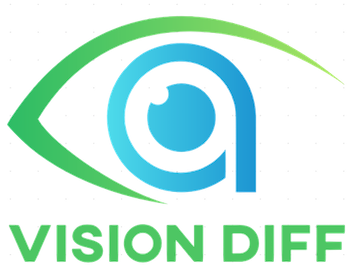
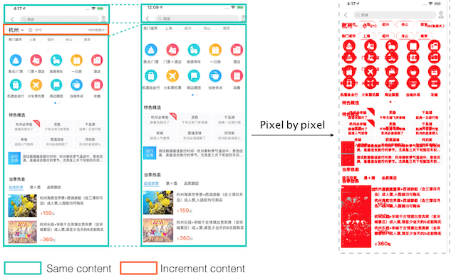
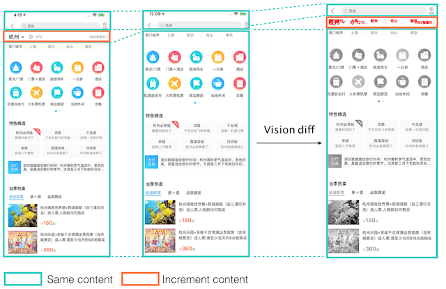
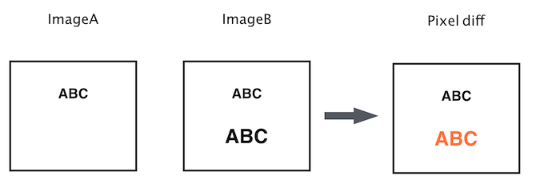
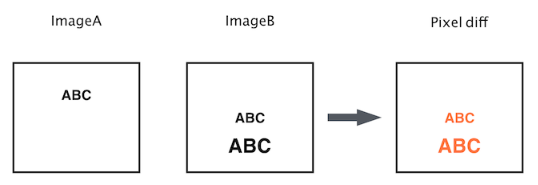
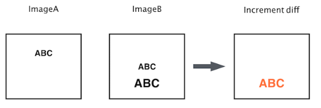

> A line-oriented image diff algorithm

[中文说明](./README-CN.md)

**Vision-diff** is an image comparison algorithm just like the [diff utility](https://en.wikipedia.org/wiki/Diff). It is line-oriented rather than pixel-oriented, as a result, it returns a much more clear differences than the traditional pixel based image comparison algorithm (See the below example).





Vision-diff is designed to find out the changes between two versions of the same images, optimized for direct mobile device screenshot.

## Usage
### Container Service
Vision provides docker container for service usage.

[container-service](./container-service.md)


## Requirements

Python3.5 or higher

```bash
pip install  -r requirements.txt
```


### Perform vision diff
Vision diff can be used as a Python library.

- image_diff() takes three parameters, the first two are the file paths to the images to be compared.
- The third parameter is the path of the output image.
- The differences between the two images will be in red color in the output image.

```python
from image_diff import ImageDiff

img = ImageDiff()
img.increment_diff("1.png", "2.png", "output_img.png")
```

It is recommended that the input image has a resolution width of 1080.

There are some advanced parameters in "image_diff.py", you can customize these params for your own needs:
  - "w" is the width of filter, scattered lines will filtered with higher value
  - "padding" is for handling fixed area on the right side of the image
  - "h_scale" is the (header height of image)/(width of image)
  - "hash_score" is the value of line processed as same
  - "pixel_value" is for calculating points pixel value in one dimensional space


### Similarity score

You can also get the similarity score from the two images using vision diff library.

```python
from image_similar import HashSimilar

score = HashSimilar.get_similar("1.png", "2.png")
```

There are three score values. Usually we can get such score first from the two images to be compared, and perform vision diff only when it equals to 0.8.

  - 1.0: images are the same
  - 0.8: partially similar
  - 0.2: entirely different


## Image increment diff
Traditional image diff based on pixel comparison works well when ImageB is similar with imageA both on
content and position.



However, When ImageB has a small shift the pixel diff will not work as we want, as pixel has position information.



Vision diff compares two images with handling this, as the algorithm will show the increment content



### Mobile App testing
- In mobile testing, sometimes we need to compare two screenshots from different devices or App versions, especially for compatibility testing. With the traditional pixel based algorithm, when there is only a little bit offset, we still get a result that the two images are entirely different.


- With vision diff, the two images are compared as if they were text files. The result is much more helpful so we can only focus on the real differences.


## Performance

The processing time is around 2-6s on corei7@2.2GHz. Higher similarity score takes less time.

## Reference

The path calculation of Vision-diff refers to [this paper](http://www.xmailserver.org/diff2.pdf).
