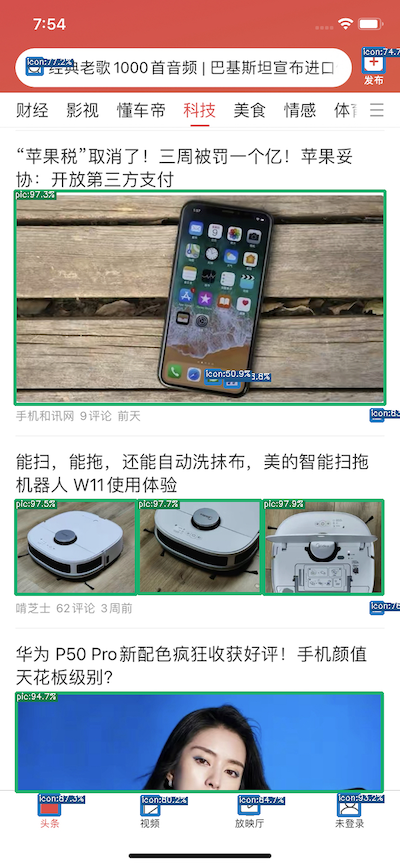

# Vision UI

# 简介

Vision UI 源于美团视觉测试工具，提供基于图像的UI处理和分析

本项目无需训练模型，提供训练框架的项目在[Vision-ml](https://github.com/Meituan-Dianping/vision)

## 特性

* 超越像素对比-[视觉对比](resources/vision_diff_cn.md)

* 基于模板匹配-[图像融合](resources/vision_merge.md)

* 预训练模型-[UI目标检测](resources/vision_infer.md)

* 集成模型-[文本识别](resources/vision_text.md)

## 效果展示
### 图像融合
| 1.png                           | 2.png                           |  3.png                   | merge                                  |
| ------------------------------ | -------------------------------- | -------------------------------- | ------------------------------------- |
|           |                   |         |                  

### UI目标检测
| App1                    | App2                    | App3                    |
|-------------------------|-------------------------|-------------------------|
|  |  |  |

### 视觉对比

| base                           | comparison                       | diff                                  |
| ------------------------------ | -------------------------------- | ------------------------------------- |
|           |             |                  |

## License

This project is licensed under the [MIT](./LICENSE) 

