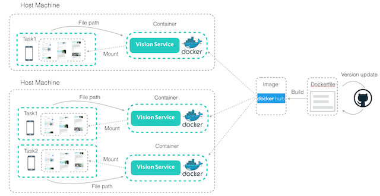

# 容器服务

## 系统设计



## 使用说明

### 环境要求

[安装Docker](https://yeasy.gitbooks.io/docker_practice/install/mac.html) 

### 部署容器

如果本地需要处理的图像文件在/User/image，根据实际替换为实际路径，本地使用的服务端口为9092，执行如下命令启动容器

```bash
docker run -it -d --name container_vision -p 9092:9092 -v /User/image:/vision/capture brighthai/vision
```

通过Http协议请求服务，参数"image1"和"image2"表示参与对比计算的图像文件名，可以使用已经准备好的调试图像[1.png](image/container_image_1.png)和[2.png](image/container_image_2.png)，参数"image_diff_name"表示生产对比图像后的保存路径
```bash
curl -H "Content-Type:application/json" -X POST --data '{
  "image1":"1.png",
  "image2":"2.png",
  "image_diff_name":"1_2_diff.png"
}' http://localhost:9092/vision/diff
```
服务返回
```bash
{
  "code":0, #值范围[0-正常,1-服务错误]
  "data":0.8 #值范围[0.2-页面不一致，不生成对比图，0.8-增量对比，生成对应路径的对比图，1.0-页面相同，没有对比图]
}
```