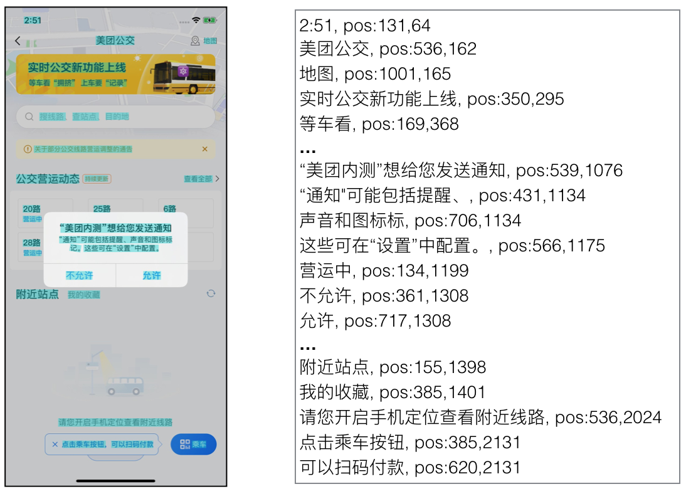

# Vision text

> 基于图像的文本解析


文本识别引擎基于[chinese-ocr-lite](https://github.com/ouyanghuiyu/chineseocr_lite)





## 使用说明

### 部署服务

* [Docker部署服务](container_service.md)

### 请求参数

通过Http协议请求服务，参数"image"表示图像文件的路径
```bash
curl -H "Content-Type:application/json" -X POST --data '{
  "image":"image_1.png"
}' http://localhost:9092/vision/text
```
服务返回
```bash
{
  "code":0, 
  "data":[
    {
      "pos": [100,200], #表示可点击的坐标
      "text": "用户使用说明"  #图像解析到的文本内容
    },{
      "pos": [300,500],
      "text": "同意"
    }
  ]
}
```
