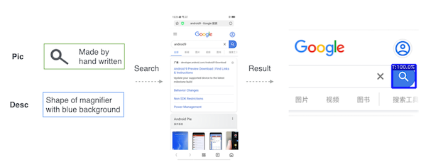

# UI目标追踪

> Vision-trace



### 简介
一种鲁棒性的UI目标查找和追踪

### 本地调试

1.CLIP环境配置
```shell
pip install git+https://github.com/openai/CLIP.git
```

2.可选 - 查看ui-infer对目标的检测情况，详见[目标检测](vision_infer.md)

3.调试代码vision-ui/services/image_trace.py

- 第一次运行代码，可能需要一段时间下载CLIP预训练模型
- 查找参数定义
```shell
top_k = 3  # 最大匹配数量
text_alpha = 0.5  # 文本语义关联性系数
```
- 目标描述定义
```shell
target_image_info = {
    'path': "./capture/local_images/search_icon.png", // 图片地址
    'desc': "shape of magnifier with blue background" // 描述如形状,背景和颜色
}
```


